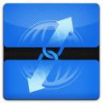

# Privacy Protector

## Overview

**Privacy Protector** is a Chrome extension designed to help you maintain your online privacy by blocking trackers, managing cookies, and clearing browsing data. With an easy-to-use interface, you can quickly control your privacy settings to ensure a safer browsing experience.

## Features

- **Clear Browsing Data**: Selectively remove cookies, cache, and browsing history.
- **Block Trackers**: Activate tracker blocking to prevent websites from tracking your activity.
- **Block Specific Websites**: Easily block unwanted websites to enhance your browsing privacy.
- **Control Third-Party Cookies**: Disable third-party cookies directly from the popup.

## Installation

1. Download or clone the repository to your local machine.
2. Open Chrome and navigate to `chrome://extensions/`.
3. Enable "Developer mode" in the top right corner.
4. Click on "Load unpacked" and select the folder where the extension files are located.
5. The Privacy Protector extension will now appear in your extensions list.

## Usage

1. Click the **Privacy Protector** icon in the Chrome toolbar to open the popup.
2. To clear browsing data, check the corresponding boxes and click **Clear Data**.
3. Toggle the **Block Trackers** option to enable or disable tracker blocking.
4. Enter a website URL in the **Block Specific Site** field and click **Block** to prevent access to that site.

## API Permissions

The extension uses the following Chrome APIs:

- **browsingData**: For clearing browsing data.
- **declarativeNetRequest**: For blocking specific websites and trackers.
- **storage**: To store user preferences.

## Future Improvements

- Add options for users to customize the tracking protection level.
- Implement a feature to view blocked sites and manage them.
- Add notifications for actions taken by the extension.

## Contributing

Contributions are welcome! If you have suggestions or improvements, please create a pull request or open an issue.

## License

This project is licensed under the MIT License. See the [LICENSE](LICENSE) file for details.

---

Thank you for using **Privacy Protector**! Stay safe online.
